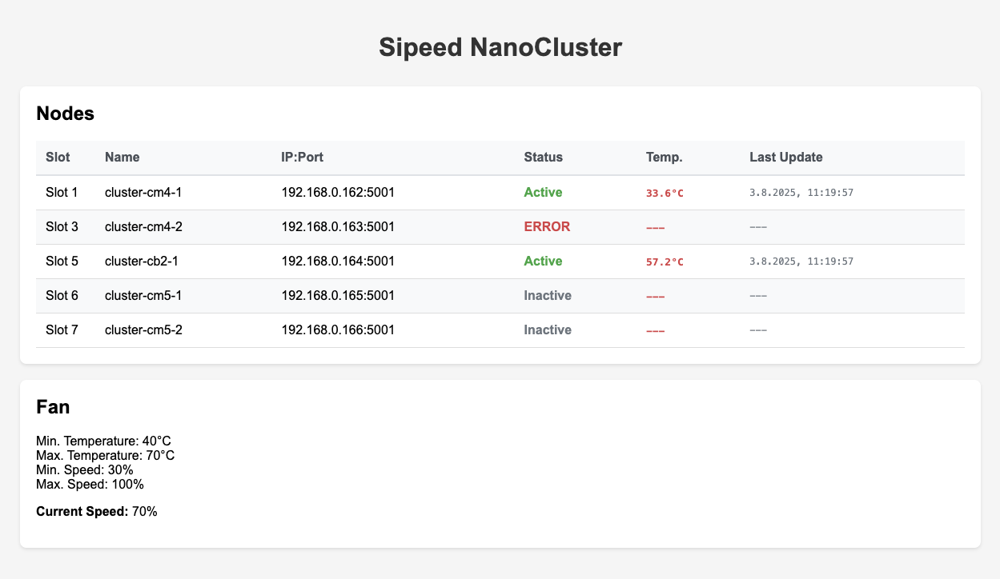
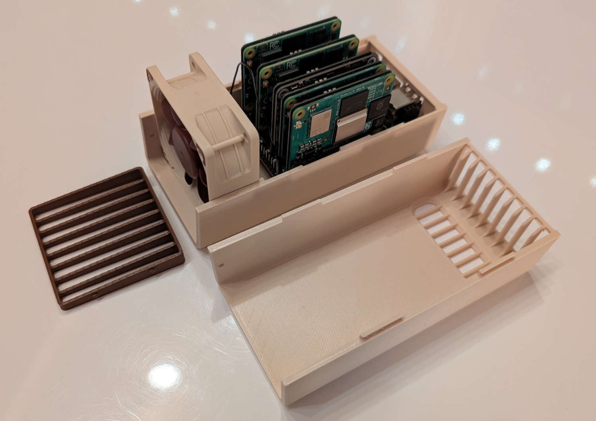

# Sipeed NanoCluster Server

A temperature monitoring and fan control system for the Sipeed NanoCluster. The
system consists of a central server (running on SBC in Slot 1) and agent
services on all nodes that provide the temperature data for monitoring and fan
control.




I designed a custom case for the Sipeed NanoCluster with Noctua fans to
ensure optimal cooling and quiet operation. The case is available on
[Printables](https://www.printables.com/model/1376174-sipeed-nanocluster-case-noctua-edition).

## 🚀 Features

- **Central Web Dashboard** - Clear display of all node temperatures and fan
  status
- **Intelligent Fan Control** - GPIO-based fan control based on temperatures
  from all nodes
- **Temperature Monitoring** - Regular polling of all nodes for temperature
  data
- **REST API** - Complete API for integration into other systems
- **Systemd Integration** - Runs as system service with automatic startup
- **Multi-Node Support** - Supports multiple nodes in the NanoCluster
- **Easy Installation** - Simple installation and configuration via scripts

## 📋 System Requirements

- **Raspberry Pi** with GPIO support (for the server on Slot 1)
- **Python 3.11+** on all nodes (maybe lower versions work, but not tested)
- **systemd** for service management
- **Network connectivity** between all nodes

## 🖥️ Server Installation (Node in Slot 1)

The server must be installed on the Node in **Slot 1** of the NanoCluster as it
has the GPIO pins for fan control.

### 1. Clone repository
```bash
sudo apt update && sudo apt install -y git
cd /opt
sudo git clone https://github.com/meteyou/sipeed-nanocluster-server.git
cd sipeed-nanocluster-server
```

### 2. Install server
```bash
sudo ./install_server.sh
```

The installation script automatically performs the following steps:
- Installation of `pigpio` and `python3-pigpio` system packages
- Enable and start the `pigpiod` daemon
- Create service user `sipeed-nanocluster`
- Install all Python dependencies
- Copy example configuration
- Set up systemd service

### 3. Adjust configuration
```bash
sudo nano /opt/sipeed-nanocluster-server/config.yaml
```

Add your nodes and adjust the fan settings as needed. The configuration file is
well documented and allows you to specify the IP addresses, ports, and other
settings for each node in the cluster.

### 4. Start service
```bash
sudo systemctl start sipeed-nanocluster-server
sudo systemctl status sipeed-nanocluster-server
```

### 5. Access web interface
Open your browser and navigate to:
```
http://<server-ip>:5000
```

## ⚙️ Server Configuration (config.yaml)

```yaml
server:
  host: "0.0.0.0"          # Server bind address
  port: 5000               # Port for web interface

temperature_monitoring:
  interval_seconds: 30     # Polling interval in seconds
  endpoint: "/api/temperature"  # API endpoint on clients
  timeout: 5               # HTTP timeout in seconds

nodes:
  - name: "cluster-cm4-1"  # Node name (unique)
    slot: 1                # Physical slot in cluster
    ip: "192.168.1.101"    # IP address of node
    port: 5001             # Port of client service
    enabled: true          # Node active/inactive

  - name: "cluster-cm4-2"
    slot: 3
    ip: "192.168.1.102"
    port: 5001
    enabled: true

fan:
  gpio_pin: 13             # GPIO pin for fan control
  min_temp: 40             # Minimum temperature (°C)
  max_temp: 70             # Maximum temperature (°C)
  min_speed: 30            # Minimum fan speed (%)
  max_speed: 100           # Maximum fan speed (%)
```

### Configuration options explained:

#### Server Section
- **host**: IP address the server listens on (`0.0.0.0` = all interfaces)
- **port**: Port for web interface and API

#### Temperature Monitoring
- **interval_seconds**: How often (in seconds) all nodes are polled
- **endpoint**: API path on client nodes for temperature queries
- **timeout**: HTTP timeout for node queries

#### Nodes
For each node in the cluster:
- **name**: Unique name of the node
- **slot**: Physical slot number in the NanoCluster
- **ip**: IP address of the node
- **port**: Port of the client service (default: 5001)
- **enabled**: `true` for active monitoring, `false` to disable

#### Fan Control
- **gpio_pin**: GPIO pin for PWM fan control (default: Pin 13)
- **min_temp/max_temp**: Temperature range for fan regulation
- **min_speed/max_speed**: Fan speed in percent (0-100%)

## 💻 Agent Installation (All Nodes)

The Agent service must be installed on **all nodes**, including the master node
(Slot 1). This service provides the temperature data and provides the API for 
the server to query.

### 1. Clone repository (on each node)
```bash
sudo apt update && sudo apt install -y git
cd /opt
sudo git clone https://github.com/meteyou/sipeed-nanocluster-server.git
cd sipeed-nanocluster-server
```

### 2. Install Agent
```bash
sudo ./install_agent.sh
```

The installation script:
- Creates/uses the shared service user `sipeed-nanocluster`
- Installs only the necessary Python dependencies for the agent
  (flask pyyaml waitress)
- Copies example configuration
- Sets up systemd service

### 3. Adjust Agent configuration
```bash
sudo nano /opt/sipeed-nanocluster-server/client_config.yaml
```

Adjust the configuration to match your node's settings, especially the path to
the temperature file, when you are not using a Raspberry Pi.

### 4. Start Agent service
```bash
sudo systemctl start sipeed-nanocluster-agent
sudo systemctl status sipeed-nanocluster-agent
```

### 5. Test API
```bash
curl http://localhost:5001/api/temperature
```

## ⚙️ Agent Configuration (agent_config.yaml)

```yaml
server:
  host: "0.0.0.0"          # Client bind address
  port: 5001               # Port for temperature API
  debug: false             # Debug mode on/off

temperature:
  thermal_path: "/sys/class/thermal/thermal_zone0/temp"  # Path to temperature file

logging:
  level: "INFO"            # Log level: DEBUG, INFO, WARNING, ERROR
```

### Agent configuration options:

#### Server Section
- **host**: IP address the Agent service listens on
- **port**: Port for temperature API (must match server configuration)
- **debug**: Debug mode for development

#### Temperature
- **thermal_path**: System file for temperature values
  - Default (Raspberry Pi): `/sys/class/thermal/thermal_zone0/temp`
  - Alternative: `/sys/class/thermal/thermal_zone1/temp`

#### Logging
- **level**: Log detail level

## 🔧 Service Management

### Server Service
```bash
# Check status
sudo systemctl status sipeed-nanocluster-server

# Start/stop/restart service
sudo systemctl start sipeed-nanocluster-server
sudo systemctl stop sipeed-nanocluster-server
sudo systemctl restart sipeed-nanocluster-server

# View logs
sudo journalctl -u sipeed-nanocluster-server -f

# Enable/disable autostart
sudo systemctl enable sipeed-nanocluster-server
sudo systemctl disable sipeed-nanocluster-server
```

### Agent Service
```bash
# Check status
sudo systemctl status sipeed-nanocluster-agent

# Start/stop/restart service
sudo systemctl start sipeed-nanocluster-agent
sudo systemctl stop sipeed-nanocluster-agent
sudo systemctl restart sipeed-nanocluster-agent

# View logs
sudo journalctl -u sipeed-nanocluster-agent -f
```

## 🌐 API Endpoints

### Server API (Port 5000)
- `GET /` - Web dashboard
- `GET /api/nodes` - List of all configured nodes
- `GET /api/nodes/temperatures` - Current temperatures of all nodes
- `GET /api/fan/config` - Fan configuration
- `GET /api/fan/status` - Current fan status

### Client API (Port 5001)
- `GET /` - Client status page
- `GET /api/temperature` - Current node temperature
- `GET /api/health` - Health check

## 🐛 Troubleshooting

### Server won't start
```bash
# Check logs
sudo journalctl -u sipeed-nanocluster-server -f

# Check pigpio daemon
sudo systemctl status pigpiod
```

### Agent connection failed
```bash
# Client service status
sudo systemctl status sipeed-nanocluster-agent

# Test network connectivity
curl http://<client-ip>:5001/api/health

# Check thermal zone
cat /sys/class/thermal/thermal_zone0/temp
```

## 🤝 Contributing

Contributions are welcome! Please create an issue or pull request. This project
is just getting started, and your help is appreciated. There are many ideas for
improvements, such as:
- More detailed web dashboard
- Better fan control algorithms
- Integration with other systems (e.g., MQTT, Home Assistant)
- Support for more hardware platforms (e.g., Orange Pi, Radxa)
- Improved error handling and logging
- Unit tests and documentation
- Support for more temperature sensors
- Support more GPIO pins to control/reset the nodes

Please check the [issues](https://github.com/meteyou/sipeed-nanocluster-server/issues)
for existing feature requests or create a new one if you have an idea.

## Support and Donations

If you like this project and want to support further development, you can give a
small donation via these platforms:

- [Patreon](https://www.patreon.com/meteyou)
- [GitHub Sponsors](https://github.com/sponsors/mainsail-crew)
- [Ko-Fi](https://ko-fi.com/mainsail)

**Pay attention:** These donation platforms are from the Mainsail project, which
is the main project of the author. The Sipeed NanoCluster Server is a side
project and not directly related to Mainsail. However, all donations will help
support the development of this and other projects.
